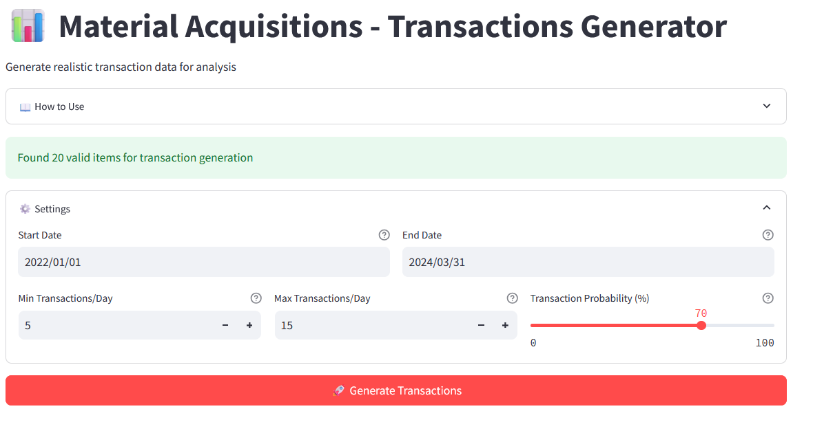

# Material Acquisitions Analytics Platform

## Overview
A comprehensive analytics platform for material acquisitions data, providing transaction generation, price analysis, supplier performance tracking, and strategic insights. This tool helps procurement teams make data-driven decisions by analyzing pricing patterns, supplier performance, and identifying cost-saving opportunities.



## Features

### 1. Transaction Generation & Analysis
- Generate realistic transaction data based on historical patterns
- Configurable parameters for transaction frequency and volume
- Monthly trend analysis with interactive visualizations
- Category-wise distribution analysis

### 2. Price Analysis
- Compare listed prices vs supplier prices
- Identify potential cost savings
- Track price variations across suppliers
- Category-wise pricing analysis
- Price spread analysis for negotiation opportunities

### 3. Supplier Analytics
- Comprehensive supplier performance tracking
- Lead time analysis
- Price competitiveness assessment
- Category coverage analysis
- Supplier risk assessment

### 4. Advanced Insights
- Supply chain risk identification
- Cost-saving opportunities
- Strategic recommendations
- Category-level insights
- Trend detection and analysis

## Installation

1. Clone the repository:
```bash
git clone https://github.com/yourusername/material-acquisitions.git
cd material-acquisitions
```

2. Create a virtual environment (recommended):
```bash
python -m venv venv
source venv/bin/activate  # On Windows: venv\Scripts\activate
```

3. Install required packages:
```bash
pip install -r requirements.txt
```

## Required Data Files

The application requires two CSV files in the root directory:

### Master.csv
Contains product master data with the following required columns:
- Item #
- Name
- CATEGORY
- Commodity
- Price
- Description (optional)

Example format:
```csv
Item #,Name,CATEGORY,Commodity,Price
V1000,"Stud Metal, 3-5/8"",10'",FRAMING/DRYWALL,Structural Products,7.64
```

### Suppliers.csv
Contains supplier information with the following required columns:
- Item #
- Supplier name
- Supplier price
- Supplier lead time (optional)

Example format:
```csv
Item #,Supplier name,Supplier price,Supplier lead time
V1000,Supplier A,7.50,7
```

## Usage

1. Start the application:
```bash
streamlit run app.py
```

2. Access the web interface at `http://localhost:8501`

3. Use the Settings panel to configure:
   - Date range for transaction generation
   - Transaction frequency parameters
   - Analysis preferences

4. Navigate through different analysis tabs:
   - Transaction Preview
   - Monthly Trends
   - Category Analysis
   - Price Analysis
   - Supplier Analysis
   - Advanced Insights

## Configuration

### Transaction Generation Settings
- **Start Date**: Beginning of the transaction period
- **End Date**: End of the transaction period
- **Min Transactions/Day**: Minimum number of daily transactions
- **Max Transactions/Day**: Maximum number of daily transactions
- **Transaction Probability**: Likelihood of transactions occurring on any given day

### Analysis Parameters
- Price variance thresholds
- Supplier performance metrics
- Risk assessment criteria
- Category analysis parameters

## Features in Detail

### Transaction Generation
```python
# Example of generating transactions
if st.button("Generate Transactions"):
    transactions = generate_transactions(
        start_date=start_date,
        end_date=end_date,
        min_trans=min_trans,
        max_trans=max_trans,
        probability=prob
    )
```

### Price Analysis
```python
# Example of price analysis
price_df, summary_stats = analyze_prices(master_df, suppliers_df)
```

### Supplier Analysis
```python
# Example of supplier analysis
supplier_metrics = analyze_suppliers(master_df, suppliers_df)
```

## Visualization Examples

### Monthly Trends
```python
fig = go.Figure()
fig.add_trace(go.Scatter(
    x=monthly_stats['Month'],
    y=monthly_stats['Count'],
    name='Transaction Count'
))
```

### Category Analysis
```python
fig = px.pie(
    category_stats,
    values='Amount',
    names='Category',
    title='Total Amount by Category'
)
```

## Contributing
Contributions are welcome! Please feel free to submit a Pull Request. For major changes, please open an issue first to discuss what you would like to change.

### Development Setup
1. Fork the repository
2. Create your feature branch (`git checkout -b feature/AmazingFeature`)
3. Commit your changes (`git commit -m 'Add some AmazingFeature'`)
4. Push to the branch (`git push origin feature/AmazingFeature`)
5. Open a Pull Request

## Future Enhancements
- [ ] Add machine learning predictions for price trends
- [ ] Implement automated supplier recommendations
- [ ] Add API integration capabilities
- [ ] Enhance visualization options
- [ ] Add custom report generation
- [ ] Implement user authentication
- [ ] Add data export in multiple formats

## License
This project is licensed under the MIT License - see the [LICENSE.md](LICENSE.md) file for details.

## Acknowledgments
- Streamlit for the amazing web framework
- Plotly for interactive visualizations
- Pandas for powerful data analysis capabilities

## Contact
Your Name - [@Bomino_MLa](https://x.com/Bomino_MLa)
Project Link: [https://github.com/bomino/material-acquisitions](https://github.com/yourusername/material-acquisitions)

## Support
For support and questions, please:
1. Check the [documentation](docs/)
2. Open an issue
3. Contact the development team

---

## Requirements.txt
```
streamlit==1.24.0
pandas==1.5.3
numpy==1.24.3
plotly==5.15.0
```
